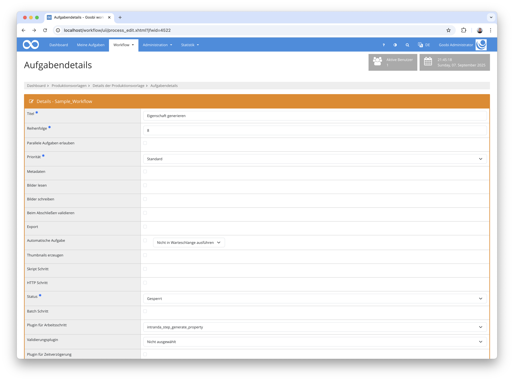

## Einführung
Diese Dokumentation erläutert das Plugin zum Generieren von Eigenschaften.

## Installation
Um das Plugin nutzen zu können, müssen folgende Dateien installiert werden:

```bash
/opt/digiverso/goobi/plugins/step/plugin-step-generate-property-base.jar
/opt/digiverso/goobi/config/plugin_intranda_step_generate_property.xml
```

Nach der Installation des Plugins kann dieses innerhalb des Workflows für die jeweiligen Arbeitsschritte ausgewählt und somit automatisch ausgeführt werden.

Für die Verwendung des Plugins muss dieses in einem Arbeitsschritt ausgewählt sein:




## Überblick und Funktionsweise
Es können beliebig viele Eigenschaften konfiguriert werden, die beim Ausführen des Plugins gesetzt werden sollen. Hierbei können sowohl statische Werte, Ausdrücke für den Variablen Replacer als auch eine besondere Spezialsyntax verwendet werden.
Bei jeder Eigenschaft können beliebig viele Ersetzungsregeln definiert werden, um den Wert zusätzlich mithilfe regulärer Ausdrücke zu manipulieren.


## Konfiguration
Die Konfiguration des Plugins erfolgt in der Datei `plugin_intranda_step_generate_property.xml` wie hier aufgezeigt:

{{CONFIG_CONTENT}}

{{CONFIG_DESCRIPTION_PROJECT_STEP}}

Parameter               | Erläuterung
------------------------|------------------------------------
`property`                      | Es können beliebig viele `property` Elemente definiert werden. Jedes Element muss die Attribute `name` und `value` enthalten. `name` definiert den Namen der Eigenschaft, `value` den zu setzenden Wert. Wenn es bereits eine Eigenschaft mit dem Namen `name` gibt, wird diese überschrieben.<br /><br />Der Wert `value` der Eigenschaft kann statischen Text enthalten, beispielsweise `text`. Darüber hinaus können auch Ausdrücke verwendet werden, die vom Variablen Replacer aufgelöst werden können, beispielsweise `{meta.CatalogIDDigital}`. Zusätzlich kann mit einer speziellen Notation `{{...}}` auf beliebige Java Variablen zugegriffen werden, die vom aktuellen `Process` Objekt heraus über Index- und Referenzoperationen erreichbar sind.<br /><br />So kann beispielsweise auf den ersten Schritt des aktuellen Vorgangs zugegriffen werden. In diesem Schritt dann auf den Benutzer, der zuletzt daran gearbeitet hat. Im Beispiel greifen wir auf den ersten Schritt zu, dessen Benutzer den Vorgang angelegt hat. Von diesem Benutzer wird dann auf die Variable `standort` zugegriffen, um die Abteilung / den Standort des Nutzers abzufragen. Das ganze sieht dann so aus: `{{schritte[0].bearbeitungsbenutzer.standort}}`.<br /><br />Unterhalb des `property` Elements können beliebig viele `replace` Elemente eingetragen werden. Jedes `replace` Element muss die Attribute `regex` und `replacement` enthalten. Nachdem der Wert der Eigenschaft initial bestimmt wurde, werden alle Ersetzungen angewandt, die in `replace` Element definiert werden. Hierbei werden alle Vorkommen des jeweiligen regulären Ausdrucks `regex` durch `replacement` ersetzt.

