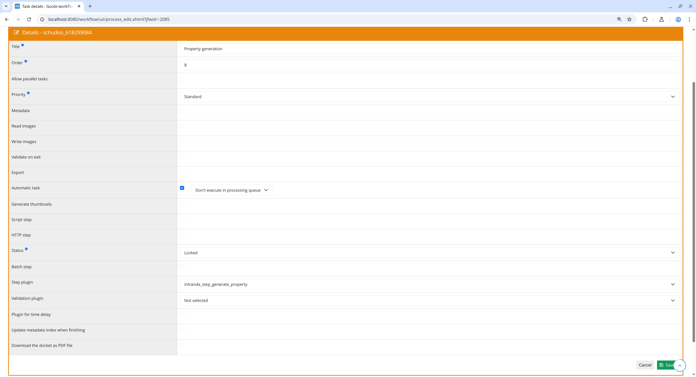

## Introduction
This documentation explains the plugin for generating properties.

## Installation
To be able to use the plugin, the following files must be installed:

```bash
/opt/digiverso/goobi/plugins/step/plugin-step-generate-property-base.jar
/opt/digiverso/goobi/config/plugin_intranda_step_generate_property.xml
```

Once the plugin has been installed, it can be selected within the workflow for the respective work steps and thus executed automatically.

To use the plugin, it must be selected in a workflow step:




## Overview and functionality


Any number of properties can be configured that should be set when executing the plugin. These can be static values, expressions for the variable replacer, or a special custom syntax.

For each property, any number of replacement rules can be defined to further manipulate the value using regular expressions.


## Configuration
The plugin is configured in the file `plugin_intranda_step_generate_property.xml` as shown here:

{{CONFIG_CONTENT}}

{{CONFIG_DESCRIPTION_PROJECT_STEP}}

| Parameter  | Explanation                                                                                                                                            |
|------------|--------------------------------------------------------------------------------------------------------------------------------------------------------|
| `property` | Any number of `property` elements can be defined. Each element must contain the attributes `name` and `value`. `name` defines the property name, `value` the value to be set. If a property with the same `name` already exists, it will be overwritten.<br><br>The `value` can contain static text, e.g., `text`. Additionally, expressions can be used that are resolved by the variable replacer, e.g., `{meta.CatalogIDDigital}`. Furthermore, a special notation `{{...}}` can be used to access arbitrary Java variables reachable from the current `Process` object via index and reference operations.<br><br>For example, you can access the first step of the current process, then the user who last worked on it. In the example, we access the first step whose user created the process. From this user, the variable `standort` (location/department) is accessed to query the user's department or location. The whole expression looks like this: `{{schritte[0].bearbeitungsbenutzer.standort}}`.<br><br>Below the `property` element, any number of `replace` elements can be added. Each `replace` element must have the attributes `regex` and `replacement`. After the initial value is determined, all replacements defined in the `replace` elements are applied, replacing all occurrences of the regex pattern with the replacement string. |
